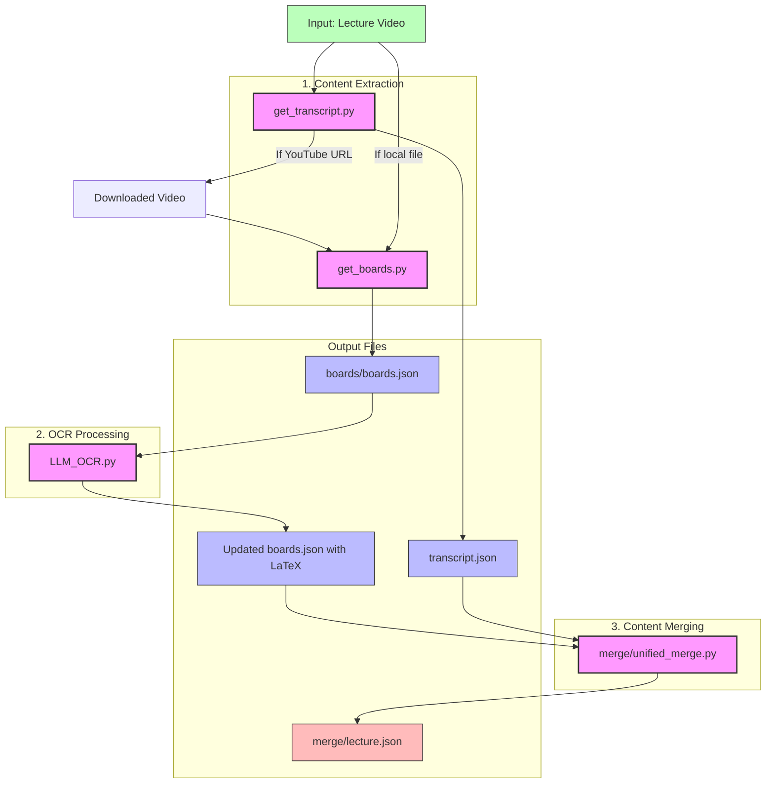

# LecToNotes Processing Flow



## Processing Steps

1. **Content Extraction**
   - `get_boards.py`: Extracts blackboard images from the video, deduplicates them, and saves metadata to `boards.json`
   - `get_transcript.py`: Transcribes the audio from the video using either local Whisper or Groq API and saves to `transcript.json`

2. **OCR Processing**
   - `LLM_OCR.py`: Processes each blackboard image using an LLM-based OCR system to convert the content to LaTeX and updates `boards.json`

3. **Content Merging**
   - `merge/unified_merge.py`: Combines the blackboard content and transcript into a unified structure organized by time segments in `lecture.json`

## Command Flow

```bash
# Complete pipeline using Makefile
make process VIDEO=path/to/lecture.mp4 TITLE="Lecture Title" DATE=YYYY-MM-DD

# Or run individual steps manually:

# For YouTube videos:
# 1. Extract transcript (this will download the video)
python get_transcript.py https://youtube.com/watch?v=VIDEO_ID --out transcript.json
# Then use the downloaded video for the next steps

# For local video files:
# 1. Extract transcript
python get_transcript.py path/to/lecture.mp4 --out transcript.json
# OR with Groq API
python get_transcript.py path/to/lecture.mp4 --use-groq --out transcript.json

# 2. Extract board images
python get_boards.py -i path/to/lecture.mp4 -o boards/

# 3. Process board images with OCR
python LLM_OCR.py boards/boards.json

# 4. Merge boards and transcript
python merge/unified_merge.py -b boards/boards.json -t transcript.json -o merge/lecture.json --title "Lecture Title" --date YYYY-MM-DD
```